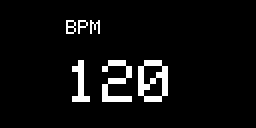
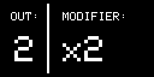
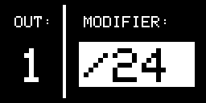
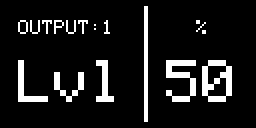
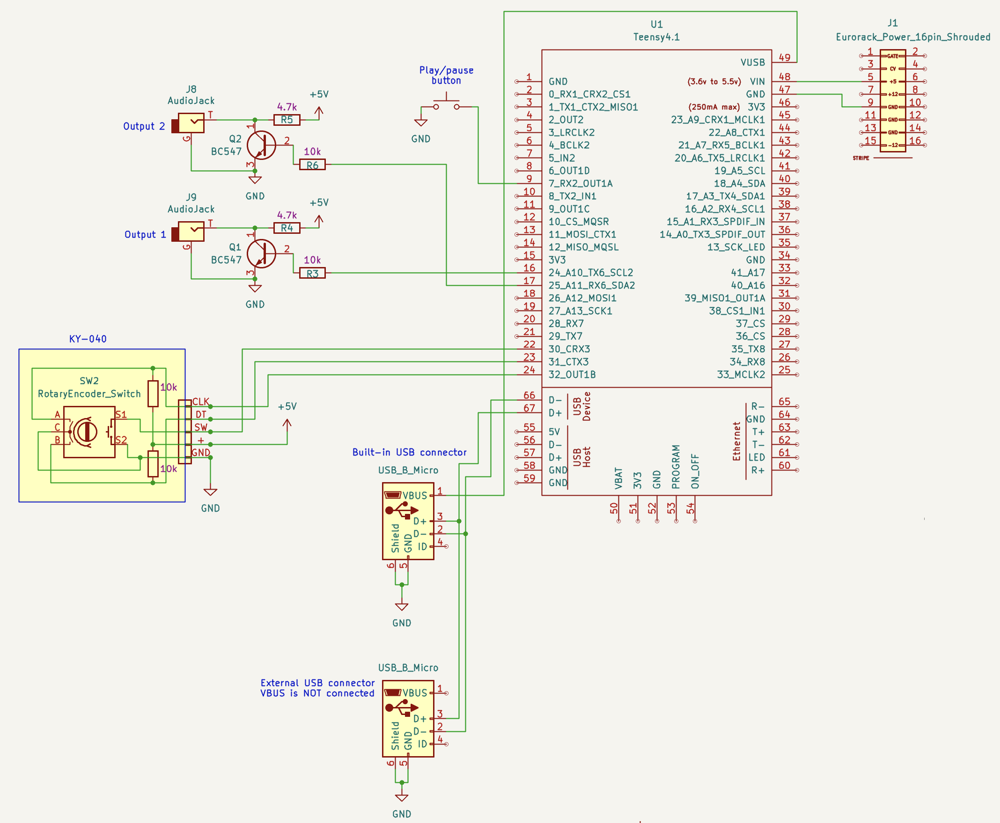

# Just Between Us

Just Between Us is a eurorack clock module heavily inspired by Pam's New Workout.

I made this module for 2 main reasons:

1. I like modular but my wallet likes it much less
2. I want to learn more about electronics and C++

This is my second large Arduino project and still consider myself a C++ and electronics noob. Keep in mind information in this repo may be inexact. I would absolutely love to be corrected on any mistake made in this project, please do get in touch! piremmanuel at gmail dot com

## Features

- 2 analog outputs (more can be added very easily)
- MIDI clock (USB)
- Play/pause button
- Rotary encoder
- OLED display (128x64)
- User interface
  - Set BPM
  - Set modifier for each output (x1, x2, x3, /2, /3, /4, ...)
  - Parameters for each output:
    - Width (duty cycle)
    - Phase

This is the very first version of this module, the prototype stage really. Analog outputs are currently limited to gates and only 2 parameters are implemented (width & phase).

## User interface

Again, borrowing heavily from Pam's New Workout.

## Schematic

The full schematics can be found in the `docs/` folder:

- [PDF](./docs/schematic.pdf)
- [KiCad](./docs/JustBetweenUs.kicad_sch)

There is no PCB yet, as this is still on breadboard at the moment.

## Details and comments

### Teensy

This module is based on a Teensy 4.1. A Teensy may be oversized for such a project, but I had one lying around and wanted to get to know the Teensy.

The experience was great, the documentation too. I never regretted this choice. I particularly enjoyed details such as being able to rename the MIDI device easily.

### Output stage

One thing that is certainly poorly designed is the output stage. The output stage is the electronics between the GPIO pin and the eurorack jack.

I went for a super simple solution with components i had on hand: transistors and resistors. This is however quite limiting, as I can only output LOW or HIGH.

This is one of the first thing on my list to improve. Being able to output any wave will open a world of possibilities!

### Power

#### 5v from eurorack

I'm currently getting 5v straight from the eurorack 5v rail. This is probably somewhat questionable. I think the right way to go is getting 12v and use a power regulator. There is a nice section about powering eurorack modules in [this post](https://blog.thea.codes/designing-big-honking-button/).

I'm also not even using decoupling caps, the reason is lazyness. Also remember: prototype stage.

#### USB and external power

The schematic includes 2 USB ports: the "built-in" one and an "external". The reason is that this module is powered by eurorack, so it receives 5v in its VIN pin. Because of that, we can't simply plug in a USB in the built-in USB port, the power coming from the USB should be separated. Here is an excellent page about this very topic: https://www.pjrc.com/teensy/external_power.html

For this reason, a second USB port ("external") allows to connect safely to a USB host but without the +5v connection.
